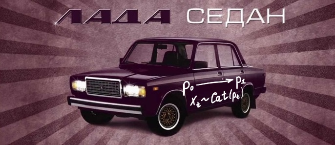

# llada

Experiments with training flow matching language diffusion model.

**Status**: work in progress (WIP)

Going to train on **FineWeb** dataset:
* 300M parameter model
* 1.5B parameter model

Already implemented:
- [x] Diffusion Transformer (DiT)
- [x] Categorical Flow Matching
- [x] Loss computation
- [x] Euler/DDIM solvers
- [x] BPE tokenizer

Things to be done:
- [ ] Data loading
- [ ] Multi-GPU training
- [ ] Block diffusion
- [ ] KV-cache

___

### Overview

Diffusion and flow models gained extraordinary performance in modeling complex continuous distributions. However, the potential of applying these algorithms to discrete token sequences generation is remaining unclear.

The core idea of this project is to use a diffusion-based training of parallel architecture combined with **flow matching** techniques to model text with a learnable, stepwise transition from uniform distributions to structured, categorical outputs. As a backbone neural network, **Diffusion Transformer (DiT)** with timestep conditioning through signal modulation is implemented.

*NOTE*: This project is inspired by the paper [Large Language Diffusion Models (LLaDA)](https://arxiv.org/abs/2502.09992), thus inherits its name, however it substantially differs in the diffusion paradigm used there (gradual unmasking learned via masked language modeling).

___

### Core ideas

Categorical Flow Matching:
* Starts from a uniform categorical distribution
* The model learns to predict the original text distribution from intermediate perturbated states sampled from linearly interpolated (via optimal transport paths) categorical distrubutions
* Training is done by minimizing cross-entropy between predicted distributions and ground truth sequences at random diffusion timestep
* During sampling, progressively transitions to a learned distribution over tokens
* At each sampling timestep, sequences are obtained using Euler/DDIM solver

Transformer Architecture (DiT):
* Embedding layers for tokens and timesteps
* Per-layer modulation parameters generated from timestep embeddings
* Multi-head self-attention with masking and flash attention support
* Residual connections and GELU-based FFNs

___

### References

For better understanding of the theory behind categorical diffusion and flow matching, consider reading:
* [Flow Matching Guide and Code](https://arxiv.org/pdf/2412.06264), Yaron Lipman et al.
* [Large Language Diffusion Models (LLaDA)](https://arxiv.org/abs/2502.09992), Shen Nie et al.
* [Scalable Diffusion Models with Transformers (DiT)](https://arxiv.org/abs/2212.09748), William Peebles et al.
* [Generative Modeling by Estimating Gradients of the Data Distribution](https://yang-song.net/blog/2021/score/), Yang Song's blogpost

___

   
  <i>Russian meme :)</i>

